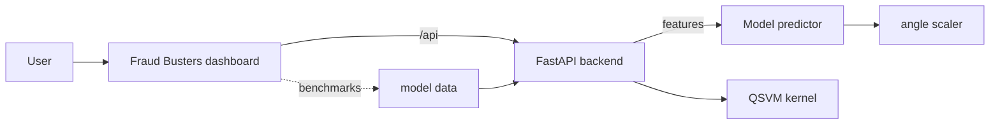

# 🛡️ FraudBusters — Quantum-Enhanced Fraud Detection

**Q-SOLVE Hackathon 2026 (Kenya) · Challenge B · Team 3 (FraudBust3rs)**
**Quantum fraud detection for East African mobile-money networks.**

A hybrid **Quantum Machine Learning** pipeline that scores mobile-money
transactions in real time: a quantum kernel + classical SVM (QSVM) supplies the
similarity signal, benchmarked **honestly** against strong classical baselines
(XGBoost, Random Forest, Logistic Regression, RBF-SVM).

---

## 🌐 Live demo (for judges)

> **https://fraudbusters.boogiecoin.org/**
>
> - **App** — interactive Fraud Busters dashboard (overview, live analysis, benchmarks, demo scenarios)
> - **API** — `https://fraudbusters.boogiecoin.org/api/v1/overview` (live model status)
> - **Model status** — `qsvm-fraud-classifier` · `ready` · `live`

---

## Architecture



Three layers connect end to end:
1. **Model** (`model/`) — trained QSVM + classical champions + full benchmark report.
2. **Backend** (`backend/`) — FastAPI that loads the real model and serves the
   frontend's API contract.
3. **Frontend** (`frontend/`) — the dashboard; in dev it proxies `/api` to the backend.

---

## Repo map

| Area | Path | Readme |
|---|---|---|
| **Root doc** | `README.md` | this file |
| **Frontend** (React + Vite + Tailwind + Radix, vibrant dark theme) | `frontend/artifacts/fraud-busters-web` | `frontend/README.md` |
| **Backend** (FastAPI, real-model inference) | `backend/fraud-backend` | `backend/fraud-backend/README.md` |
| **Model** (classical + QSVM, benchmark report) | `model/` | `model/README.md` |
| **Deploy** (Docker + Traefik) | `deploy/` | `deploy/README.md` |

---

## API contract (what the frontend consumes)

| Endpoint | Purpose |
|---|---|
| `GET /api/healthz` | health + model readiness |
| `GET /api/v1/overview` | system posture / primary model |
| `GET /api/v1/model-config` | active model feature schema (drives the analyze form) |
| `POST /api/v1/analyze` | score a transaction → `fraud_score`, risk band, context |
| `GET /api/v1/benchmarks` | QSVM vs classical benchmark table |
| `GET /api/v1/fraud/score` (+`/batch`) | raw scoring endpoints |

Example: `POST /api/v1/analyze`
```json
{"transaction": {"amount": "285000", "oldbalanceOrg": "120000",
  "newbalanceOrig": "0", "oldbalanceDest": "0", "newbalanceDest": "120000",
  "transactionType": "CASH_OUT"}}
```
→ `{"fraud_score": 1.0, "model_used": "qsvm-fraud-classifier", "execution_mode": "live", ...}`

---

## Model highlights

- **6-qubit QSVM** (circular ZZ feature map, depth 20) — higher precision than
  classical RBF-SVM and ~80% fewer false alarms on the matched benchmark.
- **Full 50:50 balanced run (N≈16k):** QSVM F1 `0.963`, precision `94%`,
  intercepted `98.5%` of test frauds.
- **Leakage-safe features** — the post-transaction balance columns are dropped and
  replaced with `amount_to_oldbalance`, `orig_depleted`, log-scaled balances.
- Full details in `model/README.md`.

---

## Run it locally

```bash
# 1) Backend (loads the real model from model/data/)
cd backend/fraud-backend
python -m venv .venv && source .venv/bin/activate
pip install -r requirements.txt
uvicorn app.main:app --reload --port 8000      # docs at http://localhost:8000/docs

# 2) Frontend
cd frontend
pnpm install
PORT=5173 BASE_PATH=/ pnpm --filter @workspace/fraud-busters-web dev
# open http://localhost:5173  (dev proxy sends /api -> :8000)
```

> If `model/data/*.joblib` is absent the API falls back to a rule-based scorer so
> the app still runs (the UI shows `fallback` instead of `ready`).

---

## Stack
Python 3.12 · FastAPI · Qiskit / QSVM · scikit-learn · XGBoost · joblib ·
React 19 · Vite · Tailwind · Radix UI · Recharts · Docker · Traefik · Cloudflare

---

*Synthetic, anonymized transaction data only. Model output supports analyst
judgment — it does not make a guilt determination and never auto-enforces.*
